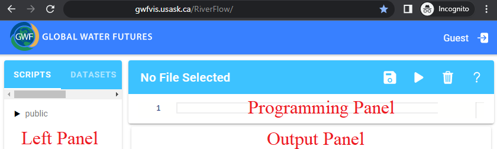
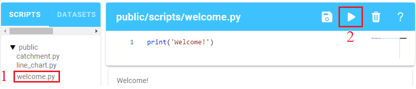
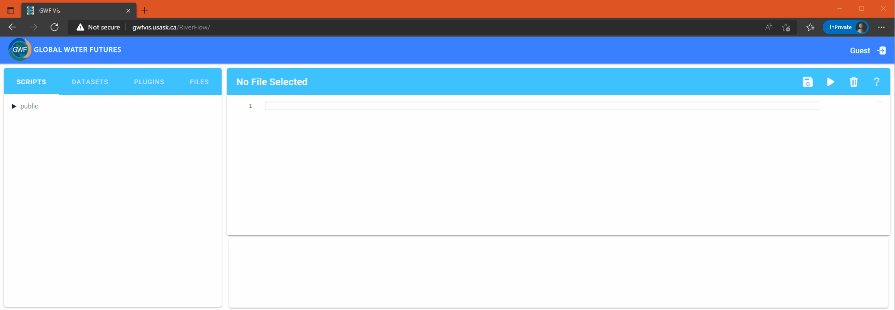

# __GWFVis__
## Introduction
GWFVis is a platform to build interactive visual interfaces to analyze  spatio-temporal data (e.g., hydrological model output, spatio-temporal weather or time series data, etc.). GWFVis allows you to build powerful visual interfaces using a small set of programming constructs, and thus reduces development time and effort. 

You can assess the GWFVis platform at [You can assess the GWFVis platform at (https://gwf-vis.usask.ca/v1/)](https://gwf-vis.usask.ca/v1/)

## Getting Started 

GWFVis consists of a programming interface, which includes a side panel, a programming panel and an output panel. 

The side panel provides an access to the file structure. Here you can find a set of scripts that are provided to you at the public directory. For example, the following two steps will run the sample script `welcome.py` to print the string  `Welcome!` on the output panel.

1. Navigate to `welcome.py` on the side panel and click on the name `welcome.py`. This loads the file content or script on the main view. 
1. Execute the script by clicking the execute button (the triangle icon on the top right).

## A Sample Script to Create an Interactive Interface

Let's now run the sample script `catchment.py` by first navigating to  `catchment.py` and then clicking the execute button (the triangle icon on the top right). This will create an interactive interface on a new tab. 

## Creating Your Own Script

You may edit the files in the public directory, but the system does not allow you to save them. To write and save your own script, you will need to login to the platform. Currently, we only support login through University of 
Saskatchewan login portal. 

1. Login with your NSID – click on the top right icon at [GWFVis](https://gwf-vis.usask.ca/v1/). You will see a new directory on the side panel which is labeled with your NSID. You can create a new file in this directory.
1. To create a new file, right click on the directory labeled with your NSID and enter a file name at the given prompt. You will see this file created in your directory.
1.	The newly created file will already have some code written in it. 	Execute the code by clicking the execute button (the triangle icon on the top right). This will open a default layout for geographic visualization in a new tab. In some instances, the geographic map view may not get rendered on your browser. If so, please resize the browser to trigger the rendering.

## Deleting a Script

1. Login with your NSID – click on the top right icon at [GWFVis](https://gwf-vis.usask.ca/v1/).
2. Right click on the script that you want to delete and a prompt will ask you to confirm.

## Documentation

To learn more, please check the [documentation](./doc.md). You can also access the documentation by clicking on the `?` mark on the top right corner of the programming panel.
 
